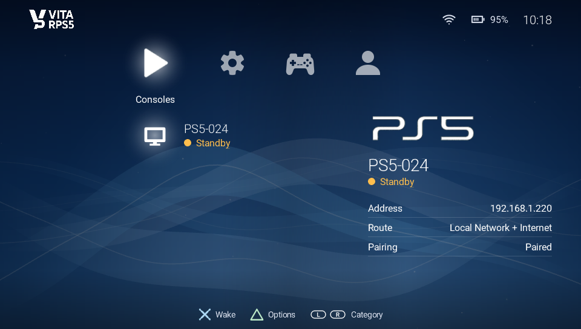
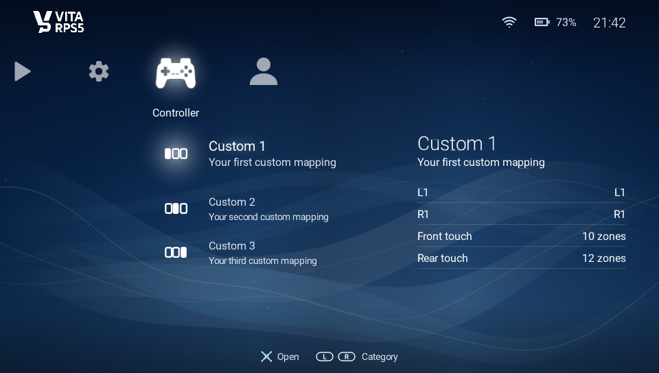
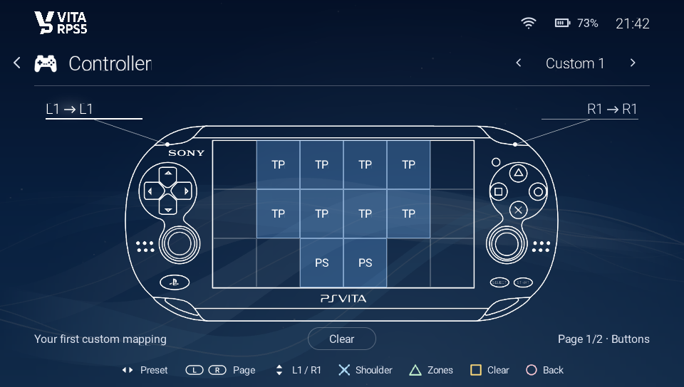
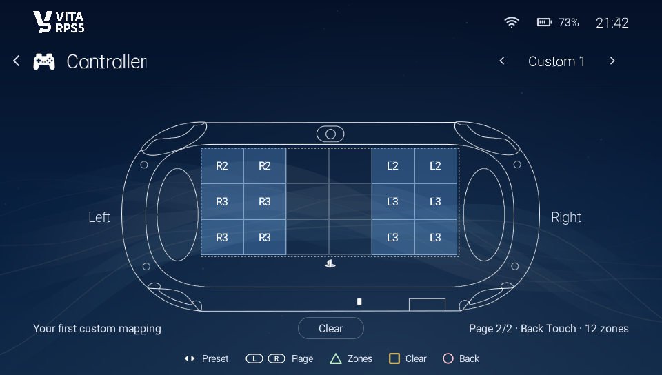
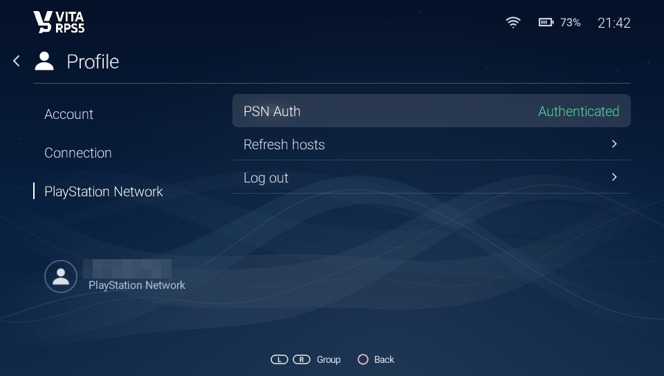
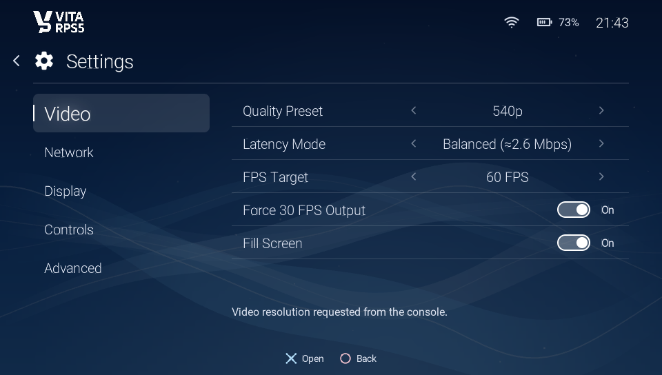

  

  # VitaRPS5

  **PS5 and PS4 Remote Play on PS Vita**

  
  
  

---

VitaRPS5 is a Remote Play client for the PS Vita and PS TV. It streams games from your PS5 or PS4 to the Vita, on your home network or, for a PS5, over the internet.

> Disclosure: VitaRPS5 was built largely with the help of AI. It was built on top of already established work, which was improved upon. It would not have been possible for me to build this without it. The design of the app was largely done by myself though, and was implemented by AI agents that could carry out the vision I had. I believe that AI can be used responsibly if proper workflows and software engineering principles are followed, and encourage people to use it as well, responsibly.

## Screenshots

  
   
  
  
  
  
  

## Features

- Console cards with auto-discovery, wake-up and automatic stream start
- Low-latency streaming with latency presets, 30/60 FPS and fill/letterbox video
- Automatic recovery from packet loss and dropped connections
- Full controller support, including L2/R2/L3/R3, touch and motion, with 3 custom mapping presets
- Internet play through your PSN account (PS5 only)

## Requirements

- A PS Vita or PS TV that can install homebrew `.vpk` files
- A PS5 or PS4 with Remote Play enabled
- For first-time pairing, the Vita and the console on the same network
- For internet play: a PS5, a PSN sign-in on the Vita, and a router that allows UDP hole punching (UPnP helps). Some networks block it, such as phone hotspots

## Install

1. Download the latest `.vpk` from [Releases](https://github.com/mauricio-gg/vitaki-vitarps5/releases/latest).
2. Copy it to your Vita.
3. Install it with VitaShell.

## First-time setup

### Pair on your local network

1. Put the Vita and the console on the same network.
2. Open VitaRPS5. Your console should appear.
3. Select it and enter the code from **PS5 > Settings > System > Remote Play > Pair Device**. Future connections will not ask again.

If your PSN account is not detected, open the Profile page, select the Profile card and press X to refresh the Account ID.

### Play over the internet (PS5)

Internet play needs the console to be **already paired on your local network first**. VitaRPS5 uses that saved pairing to connect remotely. If you skip this, the console simply does not show up.

1. Pair the console at home as above.
2. In **Settings**, turn on **PSN Internet Mode**.
3. On the **Profile** page, press X on the Connection card. The Vita shows a QR code and a sign-in link. Sign in to PSN on your phone or PC.
4. Copy the full address of the page you land on, press X on the Connection card again and paste it in.
5. When you see "PSN login complete", your paired consoles appear with a radio-wave icon.

On a console reachable both ways, tap X to connect locally or hold X for about 0.6 seconds to pick "Local Network" or "Internet". How this works and its limits: [docs/design/psn.md](docs/design/psn.md).

## Controls

| Input | Action |
|-------|--------|
| **L + R + Start** (hold about 1 second) | Stop streaming, return to menu |
| **Select + Start** | PS button |

## Getting help

How-to guides are in the [wiki](https://github.com/mauricio-gg/vitaki-vitarps5/wiki):

- [Configuration](https://github.com/mauricio-gg/vitaki-vitarps5/wiki/Configuration): all `chiaki.toml` settings
- [Logging](https://github.com/mauricio-gg/vitaki-vitarps5/wiki/Logging)
- [Crash dumps](https://github.com/mauricio-gg/vitaki-vitarps5/wiki/Crash-dumps)
- [Wi-Fi tips](https://github.com/mauricio-gg/vitaki-vitarps5/wiki/Wi-Fi-tips)
- [A/B stability testing](https://github.com/mauricio-gg/vitaki-vitarps5/wiki/A-B-stability-testing)

Quick tips:

- To reset all settings, delete `ux0:data/vita-chiaki/chiaki.toml`.
- Testing builds write a log to `ux0:data/vita-chiaki/<number>_vitarps5-testing.log` (the number is a timestamp, so each run gets its own file). Release builds write `<number>_vitarps5.log` in the same folder.

Questions and ideas go to [Discussions](https://github.com/mauricio-gg/vitaki-vitarps5/discussions). Bugs go to [Issues](https://github.com/mauricio-gg/vitaki-vitarps5/issues).

## How it works

- [docs/design/](docs/design/README.md): how the code works. [Architecture](docs/design/architecture.md), [streaming](docs/design/streaming.md) and [PSN internet play](docs/design/psn.md).
- [Wiki](https://github.com/mauricio-gg/vitaki-vitarps5/wiki): how-to guides.
- [Discussions](https://github.com/mauricio-gg/vitaki-vitarps5/discussions): ideas and questions.

## Building

Builds run in Docker through `./tools/build.sh`. See [Build and deploy](https://github.com/mauricio-gg/vitaki-vitarps5/wiki/Build-and-deploy).

## Support

If you enjoy VitaRPS5, you can support its development.

## Credits

VitaRPS5 is its own project now. It was originally based on Vitaki, [ywnico's vitaki-fork](https://github.com/ywnico/vitaki-fork), which is itself a fork of [Chiaki](https://git.sr.ht/~thestr4ng3r/chiaki) by Florian Märkl, by way of [AAGaming's](https://github.com/AAGaming00) Chiaki Vita port. Special thanks to [Epicpkmn11](https://github.com/Epicpkmn11) for motion control contributions.

Thanks also to the open-source tools that made reverse engineering possible: [Rizin](https://rizin.re), [Cutter](https://cutter.re), [Frida](https://www.frida.re) and [x64dbg](https://x64dbg.com), and to [delroth](https://github.com/delroth) for registration and wakeup protocol analysis, [grill2010](https://github.com/grill2010) for PSN OAuth analysis, and [FioraAeterna](https://github.com/FioraAeterna) for FEC and error correction insights.

Developed by [solidEm](https://github.com/mauricio-gg) with the help of [Claude Code](https://claude.com/claude-code).

## License

[AGPL-3.0](LICENSES/AGPL-3.0-only-OpenSSL.txt)
